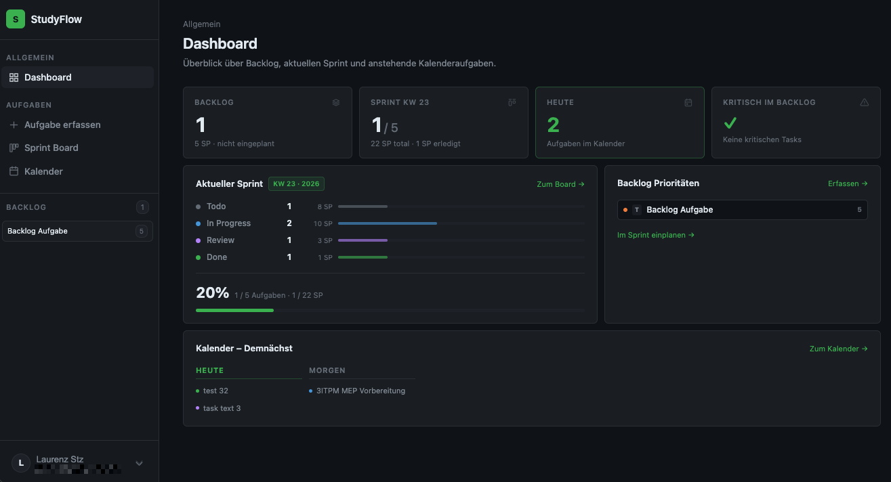
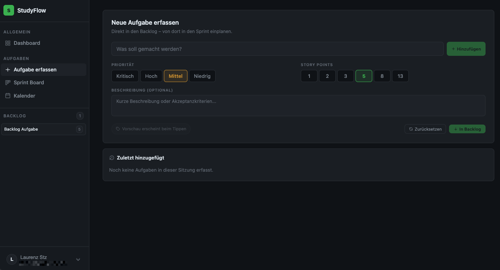
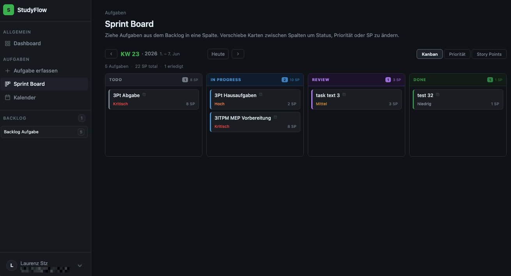
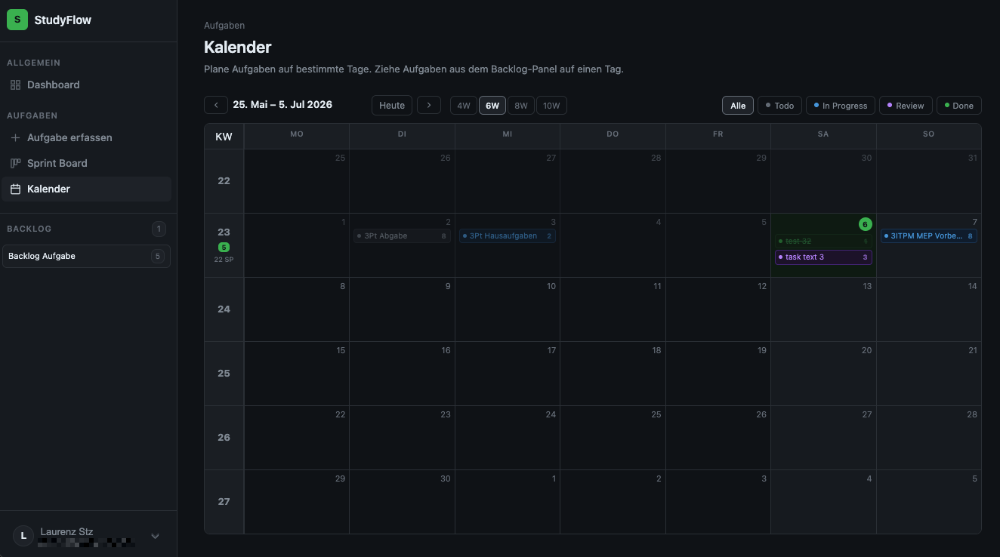
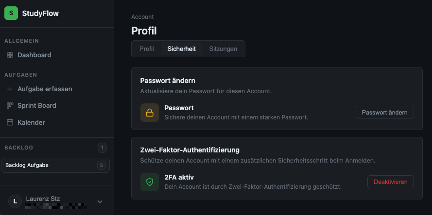
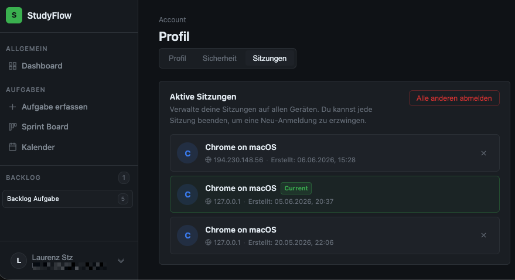

# Projektdokumentation - StudyFlow

## Inhaltsverzeichnis

1. [Ausgangslage](#1-ausgangslage)
2. [Lösungsidee](#2-lösungsidee)
3. [Vorgehen & Artefakte](#3-vorgehen--artefakte)
    1. [Understand & Define](#31-understand--define)
    2. [Sketch](#32-sketch)
    3. [Decide](#33-decide)
    4. [Prototype](#34-prototype)
    5. [Validate](#35-validate)
4. [Erweiterungen](#4-erweiterungen)
    1. [Zwei-Faktor-Authentifizierung & Session-Management](#41-zwei-faktor-authentifizierung--session-management)
    2. [Sprint Board Mehrfachansicht](#42-sprint-board-mehrfachansicht)
    3. [Task Drawer](#43-task-drawer)
5. [Projektorganisation](#5-projektorganisation)
6. [KI-Deklaration](#6-ki-deklaration)
    1. [KI-Tools](#61-ki-tools)
    2. [Prompt-Vorgehen](#62-prompt-vorgehen)
    3. [Reflexion](#63-reflexion)
7. [Anhang](#7-anhang)

## 1. Ausgangslage
- **Problem:** Im Studium häufen sich Aufgaben aus verschiedenen Modulen schnell an, Abgaben, Prüfungsvorbereitungen, Gruppenarbeiten, Lernpensen. Generische Tools wie einfache To-Do-Listen oder Google Keep stossen dabei schnell an ihre Grenzen, weil der zeitliche und strukturelle Kontext fehlt. Man weiss zwar was zu tun ist, aber nicht wann und in welcher Reihenfolge.
- **Ziele:** Eine Web-App für Studierende bauen, die Aufgaben nach Scrum-Logik verwaltet. Semesterwochen werden als Sprints behandelt, Aufgaben landen zunächst im Backlog und werden von dort in Sprints oder auf konkrete Tage eingeplant. Planung und Umsetzung sollen so nah wie möglich beieinander liegen, weniger Formulare, mehr direkte Interaktion.
- **Primäre Zielgruppe:** Studierende, die ihren Studienalltag strukturierter organisieren möchten und offen sind für ein Tool, das über eine einfache Checkliste hinausgeht
- **Weitere Stakeholder:** Keine.

## 2. Lösungsidee
- **Kernfunktionalität:** StudyFlow überträgt Scrum-Prinzipien auf den Studienalltag. Aufgaben werden im Backlog gesammelt und von dort in Sprints (also Kalenderwochen) oder auf konkrete Tage eingeplant. Das Sprint Board bildet den laufenden Status per Kanban ab, der Kalender gibt einen zeitlichen Überblick über mehrere Wochen. Das Dashboard fasst alles zusammen: offene Backlog-Tasks, Sprint-Fortschritt der aktuellen KW, heutige Aufgaben und kritische Prioritäten, ohne dass man aktiv etwas konfigurieren muss. Die zentrale Interaktion ist Drag & Drop. Tasks werden verschoben, nicht über Dropdown-Menüs eingeordnet. Das Ziel war ein "maximal zwei Klicks"-Prinzip: jede relevante Aktion soll direkt erreichbar sein, ohne durch mehrere Seiten navigieren zu müssen
- **Annahmen:** Scrum-Logik lässt sich sinnvoll auf den Studienalltag übertragen, wenn die Einheit «Sprint» einer Semesterwoche entspricht. Studierende profitieren mehr von einer strukturierten Planung mit zeitlichem Kontext als von einer reinen Priorisierungsliste
- **Abgrenzung:** Keine Team- oder Kollaborationsfunktionen, StudyFlow ist ein Einzelnutzer-Tool

## 3. Vorgehen & Artefakte

### 3.1 Understand & Define
- **Zielgruppenverständnis:** Zielgruppe sind Studierende, die ihren Studienalltag strukturierter organisieren möchten. Das Problem ist bekannt aus eigener Erfahrung: Aufgaben aus verschiedenen Modulen, Deadlines und Lernpensen lassen sich mit generischen Tools wie To-Do-Listen oder Google Keep nur unzureichend abbilden, weil der zeitliche und strukturelle Kontext fehlt.
- **Wesentliche Erkenntnisse:**
	- Studierende brauchen eine Möglichkeit, Aufgaben nicht nur zu erfassen, sondern sie zeitlich einzuplanen und ihren Status nachzuverfolgen
	- Der Wechsel zwischen Planung und Umsetzung soll so wenig Aufwand wie möglich erzeugen
	- Kollaborative Features (Teams, Rollen) wurden als Wunsch aus der Evaluation identifiziert, jedoch bewusst aus dem Scope ausgeschlossen
- **Proto-Persona:** 
    - **Name:** Lea, 22, Wirtschaftsinformatik im 4. Semester
    - **Situation:** Jongliert gleichzeitig mit Modulabgaben, Lernpensen und einem Teilzeitjob. Nutzt aktuell eine Kombination aus Google Keep und Kalender, verliert aber regelmässig den Überblick über Fristen und offene Tasks.
    - **Ziel:** Einen strukturierten Wochenplan, der zeigt was diese Woche wirklich dran ist, ohne in zehn verschiedenen Apps nachschauen zu müssen.
    - **Frustration:** Tools wie Trello sind zu komplex für den Alleingebrauch. Einfache To-Do-Listen zeigen nicht, wann etwas fällig ist oder wie viel Aufwand noch aussteht.

### 3.2 Sketch
- **Variantenüberblick:** Es wurden acht Varianten skizziert, die verschiedene Teilbereiche der App abdecken: Login-Seite (1), To-Do-Liste mit numerischer Priorisierung (2), Kalenderansicht (3), Kanban-Board nach Kategorien (4), Task-Detailansicht mit Beschreibung und Status (5), Kanban mit Ansichtsfilter per Dropdown (6), To-Do mit Sortierfunktion (7) und Quick Notes im Google-Keep-Stil (8)
- **Skizzen:** Die [Skizzen](docs/sketches/Uebung9-Abgabe-Skizze.pdf) wurden anschliessend einem Peer-Review unterzogen. Die wesentlichen Rückmeldungen: Variante 2 wurde als simpel und effektiv bewertet, Variante 4 als sehr übersichtlich, Variante 5 als zu kompliziert, Variante 6 (Kanban mit verschiedenen Ansichtsmöglichkeiten) als besonders stark. Variante 7 wurde mit dem Wunsch kommentiert, Deadlines direkter setzen zu können. Variante 8 wurde als sinnvolle Ergänzung eingestuft. Als wichtigste Features wurden 2, 4/6 und 8 identifiziert.

### 3.3 Decide
- **Gewählte Variante & Begründung:** Umgesetzt wurden primär die Varianten 2 (To-Do mit Priorisierung) und 6 (Kanban mit verschiedenen Ansichten), da diese Effizienz und Übersichtlichkeit am besten abbilden. Das Feedback zu Variante 7, dass Nutzer die App besser auf ihre eigenen Bedürfnisse anpassen können sollten, hat eine neue Idee angestossen: statt einer einfachen Deadline-Eingabe wurde später eine vollständige Kalenderansicht mit Drag & Drop integriert. Variante 8 (Quick Notes) wurde bewusst aus dem Scope ausgeschlossen, um den Fokus zu behalten. Der endgültige Funktionsumfang der App ergibt sich jedoch erst nach der Evaluation (Kap. 3.5), die einen grundlegenden Konzept-Pivot ausgelöst hat.
- **End-to-End-Ablauf:** Der zentrale Workflow des ursprünglichen Konzepts folgt dem Prinzip Erfassen -> Priorisieren -> Erledigen. Eine Aufgabe wird in der To-Do-Liste erfasst und erhält eine numerische Priorität, die per Drag & Drop angepasst werden kann. Im Kanban-Board wird sie nach Deadline (Today / This Week / This Month) eingeordnet und der Status nachgeführt. Der vollständige Ablauf ist als User Journey Map dokumentiert: [Aufgabe Woche 10](docs/mockup/Aufgabe_Woche_10.pdf)
- **Mockup:** Als erster klickbarer Prototyp entstand ein Wireframe-Mockup mit Navigation, To-Do-, Kanban- und Notes-Seite (ebenfalls in [Aufgabe Woche 10](docs/mockup/Aufgabe_Woche_10.pdf)). Nach der Evaluation und dem daraus resultierenden Konzept-Pivot, weg von einer einfachen priorisierten Taskliste, hin zu einer Scrum-orientierten Studienplanungs-App, wurde ein neues funktionales HTML-Mockup gemeinsam mit Claude Sonnet 4.6 iterativ entwickelt. Dieses diente als direkte Grundlage für die anschliessende Implementierung in SvelteKit: [HTML Mockup](docs/mockup/studyflow_v7_group_kanban.html)

### 3.4 Prototype

#### 3.4.1. Entwurf (Design)
- **Informationsarchitektur:** Die App ist in zwei Navigationsbereiche gegliedert, die über eine persistente linke Sidebar erreichbar sind. Unter "Allgemein" befindet sich das Dashboard. Unter "Aufgaben" sind die drei Hauptseiten gruppiert: Aufgabe erfassen, Sprint Board und Kalender. Der Backlog ist nicht als eigene Seite konzipiert, sondern als dauerhaft sichtbares Panel am unteren Ende der Sidebar, Tasks können direkt von dort auf das Board oder den Kalender gezogen werden, ohne die aktuelle Seite zu verlassen. Einstellungen sind über den Nutzer-Avatar am unteren Rand der Sidebar erreichbar.
- **User Interface Design:**
	- **Dashboard**: Vier Stat-Cards verschaffen auf Anhieb einen Überblick: offene Backlog-Tasks, Sprint-Fortschritt der aktuellen KW, heutige Kalenderaufgaben und kritische Tasks. Darunter folgen zwei Panels: Sprint-Status mit Fortschrittsbalken pro Spalte sowie die priorisierten Backlog-Tasks mit Direktlink zum Sprint Board. Ein dritter Bereich zeigt die nächsten sieben Tage aus dem Kalender. 
	- **Aufgabe erfassen**: Neues Tasks werden direkt in den Backlog erfasst. Titel, Priorität (Kritisch / Hoch / Mittel / Niedrig) und Story Points werden über Chip-Buttons gesetzt, ohne Dropdown-Menüs. Optional kann eine Beschreibung oder Akzeptanzkriterien hinzugefügt werden. Zuletzt erfasste Tasks der aktuellen Sitzung sind unterhalb sichtbar. 
	- **Sprint Board**: Das Board zeigt Tasks der gewählten Kalenderwoche in Kanban-Spalten (Todo / In Progress / Review / Done). Über den View-Switcher oben rechts kann zwischen drei Ansichten gewechselt werden: Kanban (Status), Priorität und Story Points. Tasks werden per Drag & Drop zwischen Spalten verschoben. Am unteren Rand erscheinen beim Ziehen zwei Drop-Zonen: zurück in den Backlog oder löschen. 
	- **Kalender**: Mehrzeilige Wochenübersicht (4–10 Wochen wählbar) mit Tagesansicht. Tasks werden per Drag & Drop aus dem Backlog-Panel auf einen Tag gelegt. Bestehende Tasks lassen sich zwischen Tagen verschieben oder per Drag auf einen Status-Filter-Button in ihrem Status ändern. Ein Sprint-Strip oberhalb der Wochenzeile zeigt unverplante Sprint-Tasks der jeweiligen KW. 
	- **Settings**: Sicherheit & Sitzungen; Die Profilseite ist in drei Tabs gegliedert: Profil (Name ändern), Sicherheit (Passwort, Zwei-Faktor-Authentifizierung) und Sitzungen (aktive Sessions geräteübergreifend einsehen und beenden). 
- **Designentscheidungen:** Das UI setzt auf ein dunkles Farbschema mit einem minimalistischen Farbprofil; Akzentfarbe Grün, Statusfarben für Prioritäten und Spalten, ansonsten Grautöne. Es werden drei Schriftgrössen und zwei Gewichtungen (Regular, Bold) verwendet. Spacing folgt konsequent der 8/4-px-Regel. Die Navigation wurde bewusst gross und persistent auf der linken Seite platziert, damit ein schnelles Wechseln zwischen den Seiten jederzeit möglich ist. Das zentrale Interaktionsprinzip ist Drag & Drop, Tasks werden verschoben, nicht über Formulare eingeordnet. Daraus ergibt sich das "maximal zwei Klicks"-Prinzip: jede Statusänderung ist direkt über das Board oder den Kalender erreichbar. Die App ist Desktop-first ausgelegt; Drag & Drop auf Touch-Geräten wird aktuell nicht unterstützt.

#### 3.4.2. Umsetzung (Technik)
- **Technologie-Stack:** SvelteKit mit Svelte 5 (Runes-API), JavaScript, CSS. Für Authentifizierung wurde die Bibliothek better-auth eingesetzt. MongoDB als Datenbank (offizieller Node.js-Treiber, kein Mongoose). Deployment via Netlify.
- **Tooling:** Visual Studio Code mit sprachspezifischen Extensions für Svelte, JavaScript und CSS (Syntax-Highlighting, Inline-Fehlermeldungen). Die Dev Containers Extension wurde zu Projektbeginn für eine lokale MongoDB-Instanz via Docker Desktop genutzt, was früh durch MongoDB Atlas ersetzt wurde. KI-Einsatz: siehe Kap. 6.
- **Struktur & Komponenten:** Die App ist in sieben Routen aufgeteilt: / (Dashboard), /todo, /sprint, /calendar, /settings, /login, /register sowie ein interner API-Endpunkt unter /api/tasks. Wiederverwendbare Komponenten liegen in src/lib/: TaskDrawer.svelte (Bearbeitungs-Panel), TaskList.svelte, sowie State-Dateien für Drag-and-Drop (dragState.js) und den Drawer-Zustand (drawerState.svelte.js). State-Management läuft vollständig über die Svelte 5 Runes ($state, $derived, $effect) ohne externe Store-Bibliothek.
- **Daten & Schnittstellen:** Alle Aufgaben werden in MongoDB gespeichert. Die Datenbanklogik ist in db2.js und mongodb.server.js gekapselt. Seitenspezifische Ladevorgänge laufen über SvelteKit +page.server.js-Dateien. Schreiboperationen (erstellen, verschieben, aktualisieren, löschen) gehen als PATCH-Requests an /api/tasks, wo per action-Feld zwischen den verschiedenen Operationen unterschieden wird. Drag-and-Drop ist mit der nativen HTML5-API umgesetzt, ohne externe Bibliothek.
- **Deployment:** https://phenomenal-salmiakki-104484.netlify.app/
- **Besondere Entscheidungen:** Bewusst auf Mongoose verzichtet, da der native MongoDB-Treiber für diesen Umfang ausreicht und eine Abhängigkeit weniger bedeutet. Svelte 5 Runes statt klassischer Stores, das war zu Projektbeginn noch relativ neu, hat sich aber für lokalen Komponenten-State als deutlich übersichtlicher erwiesen. Drag-and-Drop ohne Library zu implementieren war aufwändiger, hat aber unnötigen Overhead vermieden.  

### 3.5 Validate
- **URL der getesteten Version**: [https://capable-sherbet-2c4b97.netlify.app](https://capable-sherbet-2c4b97.netlify.app)
- **Ziele der Prüfung:** Ob der Unterschied zwischen priorisierten und nicht priorisierten Aufgaben intuitiv verständlich ist; ob Nutzer ohne Anleitung herausfinden, wie Drag & Drop und Prioritätsvergabe funktionieren; ob der Workflow "Aufgabe hinzufügen -> priorisieren -> erledigen" ohne Erklärung nachvollziehbar ist; und ob das Dashboard auf Anhieb einen sinnvollen Überblick verschafft.
- **Vorgehen:** Moderierter Test vor Ort. Die Testpersonen erhielten ein ausgedrucktes Aufgabenblatt mit fünf Szenarien und arbeiteten diese selbstständig durch, lautes Denken war erwünscht. Nach dem Test folgten fünf offene Fragen.
- **Stichprobe:** Drei Kommilitonen (Kürzel: cabdiabd, martim07, senththe), aus dem selben Studiengang; Wirtschaftsinformatik.
- **Aufgaben/Szenarien:** 
	1. Drei neue Aufgaben hinzufügen. 
	2. Einer Aufgabe über das Eingabefeld eine Priorität zuweisen. 
	3. Die Reihenfolge per Drag & Drop verändern. 
	4. Eine Aufgabe als erledigt markieren und im Dashboard prüfen. 
	5. Zwischen Dashboard und ToDo-Seite navigieren und die Statistiken interpretieren
- **Kennzahlen & Beobachtungen:** Das Drag-and-Drop-Icon zur Reihenfolgeänderung wurde von einer Testperson (cabdiabd) nicht intuitiv erkannt, der Griff-Handle war zu wenig sichtbar. Das Dashboard wurde positiv bewertet, insbesondere dass es sich dynamisch anpasst und einen Überblick verschafft, ohne dass man aktiv etwas konfigurieren muss. Das Prinzip "maximal zwei Klicks" und die Fokussierung auf Drag & Drop statt Formulare kamen gut an. Das Design wurde ebenfalls positiv erwähnt. Als Erweiterungswunsch kam der Wunsch nach Team-Funktionalität mit unterschiedlichen Rollen auf, damit Aufgaben kollaborativ verwaltet werden können
- **Zusammenfassung der Resultate:** Der Kern-Workflow funktionierte für alle drei Testpersonen ohne grössere Probleme. Der einzige klare Usability-Issue war das nicht erkannte Drag-Handle-Icon. Gleichzeitig brachte die Diskussion nach dem Test eine Richtungsentscheidung: Ich hatte die Idee eingebracht, den Prototyp mit Scrum-Logik zu erweitern, Semesterwochen als Sprints, Backlog, Sprint Board, da wir in einer Vorlesung spielerisch mit Scrum-Prinzipien gearbeitet hatten. Alle drei Testpersonen sahen darin eine sinnvolle Weiterentwicklung für den Studienalltag. Das hat die weitere Entwicklung des Projekts massgeblich beeinflusst.
- **Abgeleitete Verbesserungen:** Das Drag-Handle-Icon wurde in der Folge angepasst, um klarer als interaktives Element erkennbar zu sein. Konzeptionell wurde die App grundlegend erweitert: Aus einer priorisierten Taskliste wurde eine Scrum-orientierte Studienplanungs-App mit Backlog, Sprint Board und Kalenderansicht. Die Team-/Rollen-Funktionalität wurde als mögliche spätere Erweiterung identifiziert, jedoch bewusst aus dem aktuellen Scope ausgeschlossen, um den Fokus zu behalten.

## 4. Erweiterungen

### 4.1 Zwei-Faktor-Authentifizierung & Session-Management
- **Beschreibung & Nutzen:** Nutzer können in den Einstellungen eine Zwei-Faktor-Authentifizierung per TOTP aktivieren (inkl. QR-Code-Setup und Backup-Codes). Zusätzlich werden alle aktiven Sitzungen geräteübergreifend angezeigt und können einzeln oder gesamthaft beendet werden. Da die App personenbezogene Planungsdaten enthält, war eine solide Absicherung des Accounts sinnvoll.  
- **Wo umgesetzt:** 
	- Frontend: `src/routes/settings/+page.svelte` (Security- und Sessions-Tab).
	- Backend: `src/lib/auth.server.js` via better-auth. 
	- Datenbank: Sessions werden in MongoDB gespeichert und beim Beenden aktiv invalidiert
- **Referenz:** Screenshots in Kap. 3.4.1 ([Sicherheit](docs/screenshots/SF-05_Settings_Sicherheit.png), [Sessions](docs/screenshots/SF-06_Settings_Sitzungen.png)).
- **Aus Evaluation abgeleitet?:** Nein
- **Abgrenzung zum Mindestumfang:** Authentifizierung war nicht Teil der Übungsanforderungen. 2FA und geräteübergreifendes Session-Management gehen deutlich über eine einfache Login-Funktion hinaus.

### 4.2 Sprint Board Mehrfachansicht
- **Beschreibung & Nutzen:** Das Sprint Board kann zwischen drei Ansichten umgeschaltet werden: Kanban (nach Status), Priorität und Story Points. In jeder Ansicht funktioniert Drag & Drop.
- **Wo umgesetzt:** Vollständig im Frontend in src/routes/sprint/+page.svelte. Die Ansichtskonfiguration ist als VIEWS-Objekt strukturiert, das Spalten, Farben und das zu mutierende Feld pro Ansicht definiert. Schreiboperationen laufen über /api/tasks mit der Action setField.
- **Referenz:** Screenshot in Kap. 3.4.1 ([Sprint-Board](docs/screenshots/SF-03_Sprint-Board.png)).
- **Aus Evaluation abgeleitet?:** Teilweise, das Feedback aus der Sketch-Phase, dass Kanban mit verschiedenen Ansichtsmöglichkeiten besonders stark sei, hat diese Richtung bestärkt
- **Abgrenzung zum Mindestumfang:** Ein einfaches Kanban-Board mit fixen Status-Spalten wäre Mindestumfang. Die drei umschaltbaren Ansichten (Status, Priorität, Story Points) mit je eigenem Drag & Drop sind eine eigenständige Erweiterung.

### 4.3 Task Drawer
- **Beschreibung & Nutzen:** Anstatt Tasks über eine separate Seite zu bearbeiten, öffnet ein Klick auf eine beliebige Aufgabe — ob im Sprint Board, Kalender oder Backlog-Panel — einen Slide-in-Drawer von rechts. Titel, Beschreibung, Priorität und Story Points können direkt bearbeitet werden, ohne den aktuellen Kontext zu verlassen. Das entspricht dem "maximal zwei Klicks"-Prinzip.
- **Wo umgesetzt:** 
	- Frontend: `src/lib/TaskDrawer.svelte` mit Svelte-Transitions (`fly`, `fade`). State-Management über `src/lib/drawerState.svelte.js`. Schreiboperationen via `/api/tasks` mit Action `updateTask`.
- **Referenz:** Screenshot [Task-Drawer](docs/screenshots/SF-07_Task-Drawer.png)
- **Aus Evaluation abgeleitet?:** Nein, ergibt sich direkt aus dem Designprinzip Drag & Drop und minimalem Klickaufwand.
- **Abgrenzung zum Mindestumfang:** Tasks könnten alternativ über eine eigene Seite bearbeitet werden. Der kontextsensitive Slide-in-Drawer, der von jeder Seite aus erreichbar ist, ohne die aktuelle Ansicht zu verlassen, geht über diesen Mindestansatz hinaus.

## 5. Projektorganisation
- **Repository & Struktur:** 
	- [https://github.com/laurenzst/3Pt_myapp](https://github.com/laurenzst/3Pt_myapp) 
	- Sourcecode in `src/`
	- Projektdokumentation und Artefakte in `docs/` 
		- (Unterordner `screenshots/`, `sketches/`, `mockup/`).
- **Issue-Management:** Nicht eingesetzt.
- **Commit-Praxis:** Commits sind beschreibend gehalten und dokumentieren den Entwicklungsfortschritt feature-weise. Ab Einsatz von Claude Code wurden Commit-Messages mit KI-Unterstützung verfasst.

## 6. KI-Deklaration

### 6.1 KI-Tools
- **Eingesetzte Tools**: Claude Code (Sonnet 4.6) in VS Code als primäres Entwicklungswerkzeug; Claude Sonnet 4.6 über claude.ai für die Mockup-Entwicklung. GitHub Copilot wurde kurzzeitig getestet, aber nach einem Rückschritt im Projekt (der einen Git-Rollback erforderte) wieder aussortiert.
- **Zweck & Umfang**: Claude Code kam erst zum Einsatz, nachdem die initiale Grundstruktur stand. Danach hat das Modell den Grossteil der Implementierung übernommen: das gesamte UI, die Integration von better-auth in die bestehende App (die grundlegende Struktur hatte ich selbst aufgesetzt), 2FA, Session-Management sowie mehrere Sicherheitsaudits auf Datenbankebene. Auch die Git-Commit-Messages wurden mit Unterstützung von Claude verfasst. Über claude.ai entstand zusätzlich ein funktionales HTML-Mockup, das iterativ verfeinert wurde und als Referenz für die spätere Entwicklung im VS Code diente.
- **Eigene Leistung (Abgrenzung):** Eigenständig erarbeitet wurden der Projektaufbau (Init-Commit, Routing-Grundstruktur, erste Svelte-Seiten), die Netlify-Anbindung und die grundlegende better-auth-Struktur. Sämtliche Prompts wurden selbst formuliert. Jede Änderung wurde manuell getestet, was ein laufendes Verständnis der Backend-Logik voraussetzte.

### 6.2 Prompt-Vorgehen
Das Vorgehen war konsequent feature-orientiert: Jede neue Funktion wurde in einem eigenen, möglichst vollständigen Prompt beschrieben, bevor die Implementierung begann. Claude wurde dabei regelmässig aufgefordert, vor der Umsetzung Rückfragen zu stellen, damit Unklarheiten schon vor dem Coding geklärt werden konnten.

Als Grundlage für den gesamten Implementierungsprozess diente ein HTML-Mockup, das in mehreren Runden über claude.ai iterativ entwickelt wurde: Features wurden ergänzt, entfernt oder umgebaut, bis das Ergebnis als stabile Referenz nutzbar war. Von diesem Mockup aus wurde dann Seite für Seite im VS Code umgesetzt.

Ein zentrales Muster hat sich beim Prompting klar gezeigt: Lange, präzise Prompts führten zu stabilen Ergebnissen. Kurze oder unvollständige Prompts führten fast immer zu Feature-Breaks, die danach mehrere Korrektur-Runden benötigten. Der initiale Aufwand pro Prompt war deshalb bewusst hoch.

Bezüglich Urheberrecht wurden keine externen Assets, Fonts oder Drittinhalte eingebunden, die einer gesonderten Lizenz unterliegen würden. Das UI ist vollständig eigenständig aufgebaut

### 6.3 Reflexion
Was mich am meisten überrascht hat: wie gut Claude Code im Vergleich zu Copilot funktioniert. Copilot wurde früh getestet, führte aber zu einem schlechteren Projektstand und wurde direkt aussortiert. Mit Claude war die Arbeitsgeschwindigkeit auf einem anderen Level.

Was unterschätzt wurde: Code-Wartbarkeit. Der früh generierte Code funktionierte zwar, war aber strukturell schwach. Die Integration von better-auth war letztlich eine Gelegenheit für einen Neustart mit saubererer Basis. Auch danach gab es Momente, in denen nach Sicherheitsaudits plötzlich Features nicht mehr liefen und gezielt nachgebessert werden musste, zum Beispiel beim Session-Handling, wo das Löschen eines Datenbankeintrags zunächst nicht dazu geführt hat, dass die Session tatsächlich beendet wurde.

Die Kernerkenntnis: KI-gestützte Entwicklung setzt eigenes technisches Verständnis voraus. Wer nicht weiss, was im Backend passiert, merkt nicht, wenn etwas falsch läuft. Das kontinuierliche Testen nach jeder Änderung war daher kein optionaler Schritt, es war zwingend notwendig, um den Überblick zu behalten

## 7. Anhang
- **Quellen:**
    - Kernabhängigkeiten: [SvelteKit](https://kit.svelte.dev/), [better-auth](https://www.better-auth.com/), [MongoDB Node.js Driver](https://www.mongodb.com/docs/drivers/node/), [qrcode](https://www.npmjs.com/package/qrcode)
    - Icons: [Tabler Icons](https://tabler.io/icons) (MIT-Lizenz)
    - Keine weiteren externen Assets oder lizenzierten Inhalte verwendet
    - Visuell inspiriert von [dbackup.app](https://dbackup.app/), eine privat genutzte Backup-Applikation, deren Interface-Ansatz als gestalterische Referenz diente
- **Testskript & Materialien:** [Evaluationsunterlagen (Szenarien, Fragestellungen)](docs/sketches/Uebung9-Abgabe-Skizze.pdf)
- **Rohdaten/Auswertung:** [User Journey Map & Wireframe-Mockup](docs/mockup/Aufgabe_Woche_10.pdf) · [HTML-Mockup](docs/mockup/studyflow_v7_group_kanban.html)